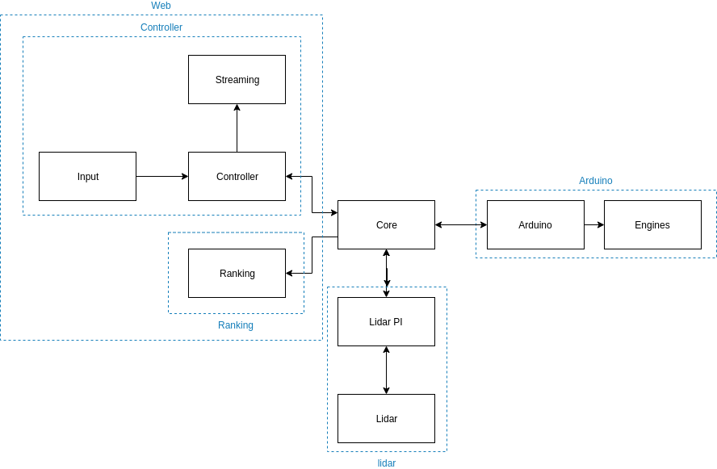

# ERS

> Eco Race Simulator

The aim of the project is to raise awareness on the theme of ecology. We  host real-word races, were the winner is fast and ecologically  sustainable.

## Authors

+ Badoino Matteo
  + [@BadoinoMatteo](https://github.com/BadoinoMatteo)
+ Francesco Bruno
  + [@FraBrunoSchool](https://github.com/FraBrunoSchool)
+ Gianluca Bernardi
  + [@GianluBerna](https://github.com/GianluBerna)
+ Pietro Jomini
  + [@PietroJomini](https://github.com/PietroJomini)
+ Simone Nardi
  + [@SimoNardi](https://github.com/SimoNardi)

## Docs

[Docs](https://ers-eco-race-simulator.github.io/Docs/#/)

## Structure

